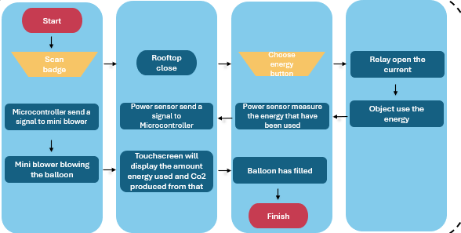

# ⚡ Smart Energy Panel — ESP8266 + 4CH Relay + 4 Buttons + Mini Blower

Proyek ini mengimplementasikan sistem kontrol energi berbasis ESP8266 sesuai flowchart:

**Scan badge → Microcontroller aktifkan mini blower → Pilih tombol energi → Relay nyalakan beban → Hitung energi & CO₂ → Finish**

Flowchart referensi:  

---

## 🧩 Perangkat Keras

| Komponen | Fungsi |
|-----------|---------|
| ESP8266 (NodeMCU / ESP-12E) | Mikrokontroler utama |
| Modul Relay 4 Channel | Mengendalikan kipas dan beban |
| Mini Blower / Kipas DC 5V | Aktuator utama |
| 4 Tombol | Pemilihan energi dan tombol Finish |
| 4 Resistor 10kΩ | Pull-down eksternal (opsional) |
| Baterai / Adaptor 5V | Sumber daya sistem |
| Kabel jumper & breadboard | Koneksi antar komponen |

> ⚠️ Pastikan semua **GND** (ESP8266, relay, kipas, baterai) tersambung bersama (common ground).

---

## ⚙️ Wiring Diagram

### Relay Connections
| Channel | Fungsi | ESP8266 Pin |
|----------|---------|-------------|
| CH1 | Mini blower | D1 (GPIO5) |
| CH2 | Beban A | D2 (GPIO4) |
| CH3 | Beban B | D6 (GPIO12) |
| CH4 | Beban C | D7 (GPIO13) |

### Tombol (Input)
| Tombol | Fungsi | ESP8266 Pin |
|---------|---------|-------------|
| BTN1 | Pilih Energi A (CH2) | D5 (GPIO14) |
| BTN2 | Pilih Energi B (CH3) | D4 (GPIO2) |
| BTN3 | Pilih Energi C (CH4) | D0 (GPIO16) |
| BTN4 | Finish (Matikan semua relay) | D3 (GPIO0) ⚠️ Jangan ditekan saat boot |

---

## 💻 Software & Library

- **Board:** NodeMCU 1.0 (ESP-12E Module)  
- **Baudrate Serial:** `115200`  
- **Library tambahan:** Tidak diperlukan  

---

## 🚀 Langkah Penggunaan

### 1️⃣ Upload Program
1. Buka **Arduino IDE**  
2. Pilih Board: `NodeMCU 1.0 (ESP-12E Module)`  
3. Pilih Port yang sesuai  
4. Salin kode utama ke `src/main.ino`  
5. Klik **Upload**

### 2️⃣ Jalankan Sistem
1. Buka **Serial Monitor (115200 baud)**  
2. Ketik **`SCAN`** lalu tekan Enter → sistem aktif  
3. Relay CH1 menyala → **mini blower mulai meniup balon**
4. Tekan tombol untuk memilih energi:
   - **BTN1:** Aktifkan relay CH2 (Energi A)
   - **BTN2:** Aktifkan relay CH3 (Energi B)
   - **BTN3:** Aktifkan relay CH4 (Energi C)
5. Tekan **BTN4 (Finish)** untuk mematikan semua relay

---

## ⚙️ Alur Sesuai Flowchart

| Langkah | Penjelasan |
|----------|-------------|
| **Start** | ESP8266 dihidupkan |
| **Scan Badge** | Disimulasikan melalui input `SCAN` di Serial Monitor |
| **Microcontroller send signal to mini blower** | Relay CH1 aktif → kipas menyala |
| **Rooftop close / Choose energy button** | Tekan tombol (BTN1–BTN3) untuk mengaktifkan relay CH2–CH4 |
| **Relay open the current** | Relay ON → objek (beban) mendapat daya |
| **Power sensor measure energy** | Energi & CO₂ dihitung secara simulatif dari durasi nyala |
| **Balloon filled / Finish** | Tekan BTN4 → semua relay OFF |

---

## 🧮 Perhitungan Energi & CO₂

Program menghitung energi & emisi berdasarkan:
Energi (Wh) = Daya (W) × Waktu_ON (jam)
Emisi CO₂ (kg) = Energi (kWh) × 0.82

Output di Serial Monitor:
FAN=ON A=OFF B=ON C=OFF E_total=0.000137 kWh CO2=0.000112 kg

| Variabel | Fungsi | Nilai Default |
|-----------|---------|----------------|
| `RELAY_ACTIVE_LEVEL` | Level logika aktif relay | `LOW` |
| `P_FAN_W`, `P_A_W`, `P_B_W`, `P_C_W` | Daya beban (Watt) | 2.5, 5, 10, 15 |
| `CO2_FACTOR` | Faktor emisi CO₂ (kg/kWh) | 0.82 |
| `DEBOUNCE_MS` | Anti-bouncing tombol (ms) | 35 |

> Jika ingin mode **timer** (ON selama durasi tertentu), aktifkan blok `MODE TIMER` di kode dan atur `D_A_MS`, `D_B_MS`, `D_C_MS`.

---

## 🧠 Troubleshooting

| Masalah | Penyebab | Solusi |
|----------|-----------|---------|
| Relay tidak merespons | Salah logika HIGH/LOW | Ubah nilai `RELAY_ACTIVE_LEVEL` |
| ESP reset saat kipas ON | Suplai 5 V lemah / GND tidak common | Satukan GND, gunakan adaptor 5V 2A |
| Tombol tidak terdeteksi | Salah wiring | Gunakan `INPUT_PULLUP`, sambungkan ke GND |
| CH1 tidak nyalakan kipas | Salah sambung NO/COM | Cek jalur: +5V → COM, NO → + kipas |
| Energi tidak berubah | Relay belum ON lama | Biarkan sistem ON beberapa detik untuk melihat perubahan |

---

## 🧩 Catatan Desain

- **Power sensor** masih disimulasikan. Nilai energi dihitung dari waktu aktif beban × daya nominal.  
  Jika nanti kamu menambah modul sensor daya (INA219/HLW8012/ACS712), perhitungannya bisa langsung diganti.  
- BTN4 (D3) jangan ditekan saat boot agar tidak masuk mode flash.  
- Kita bisa menambahkan **LED indikator** atau **buzzer** untuk status relay.
